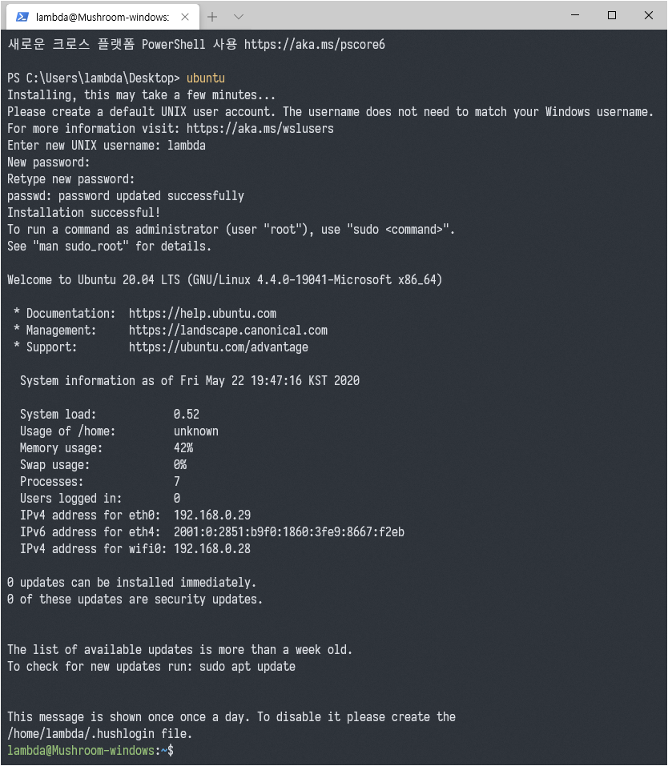
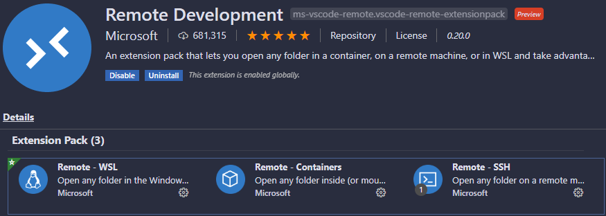

WSL2 기반 개발환경 세팅
=============================
# Introduction
Windows 10 2004 Build 19041.264 20H1 버전부터 WSL2를 공식적으로 지원한다.  
Windows Preview Insider 버전에서 사용해 본 경험을 토대로 개발환경 설정법을 정리하였다.  
본 글에서 설명할 항목은 대략적으로 다음과 같다.

* Windows 10 2004 버전
* Linux용 Windows 하위 시스템 (Windows Linux Subsystem, WSL)
* WSL2 용 리눅스 커널 업데이트 패키지
* Windows Terminal
* WSL 이미지
* Docker Desktop for Windows Edge
* Visual Studio Code & Remote Development Extension

# Setup
본 가이드라인은 Windows 10 2004 버전이 설치되었다는 가정하에 시작한다.

## 1. [Windows Linux Subsystem, WSL](https://docs.microsoft.com/ko-kr/windows/wsl/)

제어판의 Windows 기능 켜기/끄기 중 **Linux용 Windows 하위 시스템** 항목을 선택하여 설치한다.  


## 2. [WSL2 용 리눅스 커널 업데이트 패키지](https://docs.microsoft.com/ko-kr/windows/wsl/wsl2-kernel)

Windows Preview Insider 에서는 WSL2 를 활성화시키기 위해 특별한 작업이 필요하지는 않았으나, Windows 10 2004 에서는 커널 업데이트 패키지의 추가적인 설치가 필요하다.  
위에 링크된 페이지에서 **WSL2 Linux 커널 업데이트 패키지**를 다운로드하여 설치한다.


설치 완료 후 기본 WSL엔진을 WSL2로 사용하기 위해 아래와 같은 명령어로 활성화 시킨다.

```powershell
PS> wsl --set-default-version 2
```

## 3. [Windows Terminal](https://www.microsoft.com/ko-kr/p/windows-terminal/9n0dx20hk701)

Windows내에서 기본으로 제공되는 powershell은 기능적으로나 심미적으로나 상당히 실망스럽다.  
Windows 10 2004 배포에 맞춰 정식버전이 된 Windows Terminal을 설치한다.  


이후 WSL의 배포판 설치가 완료되면 아래와 같이 손쉽게 접근하여 사용할 수 있다.


## 4. WSL 배포판 설치

1, 2번 항목에서 수행한 것은 WSL을 활용하기 위한 기반 환경을 조성한 것에 지나지 않는다.  
실제로 WSL환경에서 무언가 하고 싶다면, Windows Store에서 제공하는 WSL용 배포판을 설치해야 한다.  
현재 무료로 제공되고 있는 배포판은 대략 다음과 같다.


### 4.1 [Ubuntu](https://www.microsoft.com/ko-kr/p/ubuntu/9nblggh4msv6)


설치 완료 후 아래의 명령어로 간단히 실행할 수 있다.

```powershell
PS> ubuntu
```

첫 실행 시 계정명을 설정하는 과정이 필요하다.



설치 완료 후 bash에 진입을 성공하면 아래와 같은 명령어로 기본적인 개발에 필요한 패키지를 설치한다.

```bash
$ sudo sed -i 's/archive.ubuntu.com/mirror.kakao.com/g' /etc/apt/sources.list
$ sudo apt-get update
$ sudo apt-get install git gcc gfortran gdb cmake python3-pip
$ echo 'export PATH="$HOME/.local/bin:$PATH"' >> ~/.bashrc
$ pip3 install fortran-language-server
$ pip3 install ninja
$ fortls --version
1.11.1
$ ninja --version
1.9.0.git.kitware.dyndep-1.jobserver-1
```

### 4.2 [ArchWSL](https://github.com/yuk7/ArchWSL) (Optional)
Windows Store에서 제공하지는 않지만 WSL에 Archlinux를 설치하여 사용할 수도 있다.  
한국어로 설명된 좋은 자료가 있어 해당 레포([Pommier1117/ArchWSL-GUIDE](https://github.com/Pommier1117/ArchWSL-GUIDE))로 대체한다.

## 5. Docker Desktop for Windows Edge

Windows에 설치할 수 있는 Docker 버전은 크게 두 가지가 있다.

* [Docker Desktop for Windows](https://docs.docker.com/docker-for-windows/install/)
* [Docker Desktop for Windows Edge](https://docs.docker.com/docker-for-windows/edge-release-notes/)

Edge 버전은 정식버전 대비 여러 실험적인 기능들이 추가되어 있으며, 제공되는 기능 중에는 WSL2를 백엔드로 사용하는 옵션도 존재한다. 해당 기능을 사용하기 위해 Edge 버전을 기준으로 하여 설치를 진행한다.

설치파일을 받아 실행하면 아래와 같은 옵션을 선택할 수 있다.
WSL2를 활용하기 위해 첫 번째 옵션을 체크한 후 설치를 진행한다. (설치 후 변경 가능)


설치가 완료되면 재부팅을 요구하며, 재부팅 후 트레이 영역에 Docker 아이콘이 나타난다.


해당 아이콘을 클릭하여 Settings 을 누른 후 `Resources > WSL INTEGRATION`에서 Docker 서비스의 백엔드를 선택할 수 있다.


powershell 내에서 WSL명령어로 확인할 수도 있다.

```powershell
PS> wsl -l -v
  NAME                   STATE           VERSION
* Arch                   Running         2
  Ubuntu                 Running         2
  docker-desktop         Running         2
  docker-desktop-data    Running         2
PS> wsl --set-version Ubuntu 2
```

## 6. [Visual Studio Code](https://code.visualstudio.com/) & [Remote Development Extension](https://marketplace.visualstudio.com/items?itemName=ms-vscode-remote.vscode-remote-extensionpack)

기본적인 VSCode의 사용법은 알고 있다고 가정한다.  
본 글에서는 언어별 개발환경에 대해 안내하지는 않으며, WSL 혹은 Docker 컨테이너에 접속하여 개발하는 환경을 안내하는 것을 그 범위로 한다.

VSCode를 실행한 후 확장목록에서 Remote Development 패키지를 설치한다.
해당 패키지는 **WSL**, **Containers**, **SSH** 원격개발 확장의 묶음이며, 사용자가 원하는 것을 선택하여 개별적으로 설치해도 무방하다.



확장 설치 후 VSCode 좌측 하단부의 `><`를 클릭하면 원격개발을 위한 접속 옵션이 표시된다.  


옵션 별 대략적인 설명은 다음과 같다.
* `Remote-WSL: New Window`: WSL의 기본 배포판으로 연결
* `Remote-WSL: New Window using Distro...` WSL에 설치된 배포판 중 원하는것을 선택하여 연결

두 번째 옵션을 선택하면 아래와 같이 배포판을 선택하여 접속이 가능하다.


첫 접속 시 해당 배포판의 `$HOME/.vscode-server` 경로에 remote 환경 구성을 위한 기본적인 요소들이 설치된다.
설치가 완료되면 이후 WSL 내에 언제든지 접속하여 사용할 수 있다.


WSL에 접속된 상태에서 확장 탭을 열어보면 Host OS에 설치된 확장들 중 비활성화 된 것들이 `Install in WSL: Distro` 옵션과 함께 남아있다.  
해당 확장 중 필요한 것을 선택하여 설치하면 된다.


### ** CMake 개발환경을 위한 예시 **

`C/C++/Fortran` with [CMake 개발환경 구성](https://vector-of-bool.github.io/docs/vscode-cmake-tools/index.html)을 위해 아래와 같은 확장을 설치한다.


이후 CMake 프로젝트를 만들고 컴파일러를 선택 후 `Configure` 및 `Build` 를 수행한다.


디버깅도 문제없이 잘 됨을 확인할 수 있다.


# Closing remarks 

Windows 10의 WSL이 발표된 이후 Windows 환경 내에서의 Linux 개발환경 구성이 한결 수월해졌다. 초기에 제공된 WSL1은 낮은 성능으로 인해 많은 답답함이 있었지만, Windows 10 2004 배포판에 포함된 WSL2의 정식 버전에서는 그 성능이 비약적으로 상승하였다. Docker for Windows 역시 WSL2을 백엔드로 사용하여 Hyper-V 기반에서 벗어남과 동시에 성능향상을 꾀할 수 있게 되었다.  
이러한 일련의 변화를 특별한 러닝커브 없이 체감할 수 있도록 VSCode에서 여러 확장을 제공하고 있다. 환경설정에 드는 시간은 최소화하고 개발에만 온전히 집중하도록 배려해 주는 Microsoft의 최근 행보가 상당히 마음에 든다.